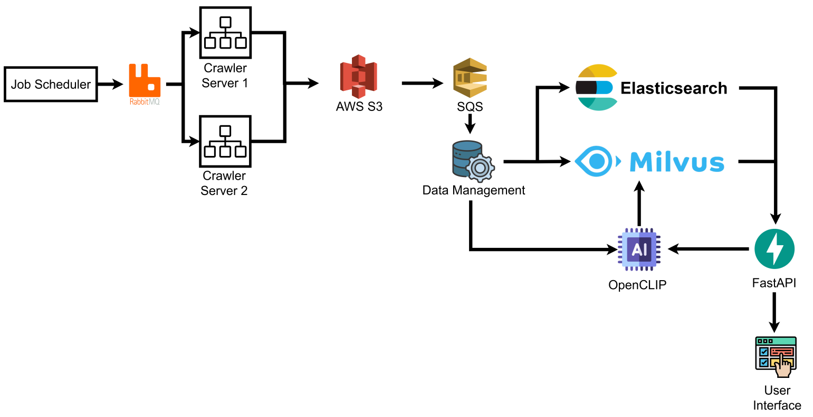

# 🎓Graduation Project: Cross-Platform Multimodal Search in E-commerce

# 📘Introduction

In recent years, Vietnam’s e-commerce market has witnessed remarkable growth, becoming a driving force in the digital economy. By 2024, e-commerce accounted for 9% of total retail sales and nearly two-thirds of the digital economy's value, placing Vietnam among the top 10 fastest-growing e-commerce nations globally.

The convenience of online shopping—enabling users to search, compare, and purchase products across platforms—has reshaped consumer behavior. However, with over 400 registered e-commerce platforms in Vietnam and major players like Shopee, Lazada, Tiki, TikTok Shop, and Sendo, product information is highly fragmented. This fragmentation complicates the product discovery process, requiring users to manually switch between apps and compare offerings.

Existing price comparison tools (e.g., websosanh.vn) rely mainly on keyword-based search, which struggles with inconsistent naming, spelling errors, and vague queries. In addition, modern websites use dynamic loading techniques (AJAX, infinite scroll), making traditional crawling methods ineffective. Many platforms also implement anti-scraping measures such as CAPTCHA or rate limits.

To address these challenges, this project proposes an end-to-end system that automates data crawling, storage, and search across platforms. Selenium is used to simulate real user behavior, allowing robust data extraction from dynamic pages. Crawled data is indexed using both **Elasticsearch** (for keyword-based search) and **Milvus** (for image and vector similarity search). The system leverages **OpenCLIP**, a multimodal deep learning model, to support image-based and hybrid searches.

# 🛠️ Technologies Used

This project integrates multiple technologies and frameworks to build a scalable, efficient, and intelligent multi-platform product search system:

#### ⚙️ Backend & Data Collection

- **Python 3.10** – Core language for backend logic and crawling pipelines
- **Selenium** – Browser automation to crawl dynamic web content (supports AJAX, lazy-loading, infinite scroll)
- **Requests** – Used for lightweight data fetching and HTML parsing (for static parts)

#### 🗃️ Data Storage & Search

- **Elasticsearch** – Full-text search engine for structured product metadata
- **Milvus v2.5** – Vector database for fast similarity search (image/text embeddings)
- **AWS S3** – Cloud storage for product images and data archives

#### 📩 Message Queues & Communication

- **Amazon SQS** – Distributed message queue for decoupling crawlers and processors
- **RabbitMQ** – Internal task queuing for scheduling and parallel processing

#### 🤖 AI & Embedding

- **OpenCLIP (ViT-L/14 336px)** – Pre-trained vision-language model for generating multimodal embeddings
- **PyTorch** – Deep learning framework to run OpenCLIP model
- **Faiss (optional)** – For local vector similarity benchmarking

#### 🌐 APIs & Integration

- **FastAPI** – Web framework for exposing search and admin endpoints
- **Uvicorn** – ASGI server for running FastAPI
- **Docker** – Containerization for deploying crawlers and services

#### 📈 Monitoring & Evaluation

- **Elasticsearch Dashboards** – For search log analysis and indexing performance
- **Custom Metrics Logging** – For measuring crawling rate, product coverage, etc.

# 🧠 System Architecture

The system is designed as a distributed, message-driven pipeline that supports large-scale data collection, preprocessing, embedding, and search across multiple e-commerce platforms. It ensures scalability, modularity, and real-time responsiveness.

#### 🧱 Architecture Overview

#### 🔄 End-to-End Workflow

1. **Job Scheduling**
   
   - A centralized scheduler pushes crawl tasks into **RabbitMQ**.

2. **Crawling Layer**
   
   - Multiple **Crawler Servers** listen to RabbitMQ and process assigned jobs.
   - Using **Selenium**, they fetch product data (metadata + images) from dynamic e-commerce pages.
   - The raw data is stored in **AWS S3**.

3. **Task Trigger via SQS**
   
   - After uploading to S3, crawlers create a processing task in **AWS SQS** for downstream services.

4. **Data Processing & Indexing**
   
   - A **Data Management** module fetches raw data from S3.
   - Metadata is indexed into **Elasticsearch** for full-text search.
   - Images and text are encoded using **OpenCLIP**, and embeddings are stored in **Milvus**.

5. **Search & API Access**
   
   - A **FastAPI** service exposes:
     - Text Search (via Elasticsearch)
     - Image/Embedding Search (via Milvus)
     - Hybrid search (text + image fusion)
   - The user interface consumes this API for seamless cross-platform product discovery.

#### ✅ System Highlights

- **Asynchronous Queuing** with RabbitMQ and SQS ensures robust task handling.
- **Separation of Concerns** allows crawling, processing, and search to scale independently.
- **Multimodal Search** enhances product matching via images and descriptions.
- **Cloud-native** components ensure flexibility, fault tolerance, and cost-effectiveness.

# 📊 Data Schema

To support both keyword-based and multimodal search, the system utilizes two types of storage backends:

- 🗃️ **Elasticsearch**: for indexing and querying structured product metadata  
- 🧠 **Milvus**: for storing high-dimensional vector embeddings used in similarity search (text/image/combined)

#### 📄 `product_information`

Stores structured metadata for keyword-based product search.

| Field          | Description                                |
| -------------- | ------------------------------------------ |
| `id`           | Unique identifier of the product           |
| `product_name` | Product title or name                      |
| `url`          | Link to the product on the source platform |
| `price`        | Current price                              |
| `rating`       | Average user rating                        |
| `review_count` | Number of reviews                          |
| `last_update`  | Timestamp of the latest data update        |
| `image_url`    | URL of the main product image              |

#### 💰 `product_price_history`

Tracks price changes over time for trend analysis.

| Field        | Description                      |
| ------------ | -------------------------------- |
| `record_id`  | Unique ID for each price record  |
| `product_id` | Reference to the product         |
| `price`      | Price value at the given time    |
| `timestamp`  | Time when the price was recorded |

#### ⭐ `product_review_history`

Monitors rating and review trends over time.

| Field          | Description                         |
| -------------- | ----------------------------------- |
| `record_id`    | Unique ID for each review snapshot  |
| `product_id`   | Reference to the product            |
| `rating`       | Recorded average rating at the time |
| `review_count` | Number of reviews at that point     |
| `timestamp`    | Time of data capture                |

#### 🧬 `product_embedding`

Enables similarity search using OpenCLIP embeddings.

| Field               | Description                                              |
| ------------------- | -------------------------------------------------------- |
| `id`                | Reference to the product (`product_information.id`)      |
| `text_embedding`    | Embedding vector derived from the product title/metadata |
| `image_embedding`   | Embedding vector derived from the product image          |
| `combine_embedding` | Joint embedding combining both text and image modalities |

#### 🔧 Extensibility & Raw Data

> ⚠️ **Note:**  
> The schema above reflects the core operational structure used in **Elasticsearch** and **Milvus** for fast search and AI processing. However, the system collects **much richer raw data**, stored in **AWS S3**, including:
> 
> - Seller info, brand, product category  
> - Shipping & promotion details  
> - Product variants (e.g., size, color)  
> - Flash sales, bundles, vouchers  
> 
> This schema is **designed for extensibility**. Additional collections (e.g., `seller_info`, `search_log`, `user_behavior`) can be added without impacting existing system behavior or performance.

# 📈 Performance Evaluation

This section presents the performance evaluation of the system across three key dimensions: data crawling speed, search accuracy, and query efficiency on real-world datasets.

#### ⚙️ 1. Data Crawling Throughput

To evaluate the scalability of the data crawling system, experiments were conducted on multiple crawler servers (each running 10 parallel crawling threads). The following table shows the total number of products collected over time depending on the number of machines:

| ⏱️ Duration | 🖥️ 1 Server | 🖥️ 2 Servers | 🖥️ 3 Servers |
| -----------:| ------------:| -------------:| -------------:|
| 1 hour      | 4,092 items  | 8,089 items   | 12,076 items  |
| 2 hours     | 7,993 items  | 16,005 items  | 23,987 items  |
| 3 hours     | 11,928 items | 23,821 items  | 35,722 items  |
| 4 hours     | 15,782 items | 31,565 items  | 47,177 items  |
| 5 hours     | 20,313 items | 40,536 items  | 60,672 items  |

> ✅ **Observation**: The system demonstrates near-linear scalability with more machines, significantly improving large-scale data collection.

#### 🔍 2. Retrieval Accuracy

Search accuracy is evaluated based on two retrieval modes:

- 📷 **Image-based search**: using image embeddings from OpenCLIP.
- 🖼️ + 📝 **Multimodal search**: using combined embeddings from both image and textual description.

| Top-k  | 🎯 Accuracy (Image Only) | 🔀 Accuracy (Image + Text) |
| ------ | ------------------------ | -------------------------- |
| Top-1  | 0.701                    | 0.723                      |
| Top-2  | 0.762                    | 0.765                      |
| Top-3  | 0.786                    | 0.795                      |
| Top-4  | 0.798                    | 0.801                      |
| Top-5  | 0.804                    | 0.807                      |
| Top-6  | 0.810                    | 0.813                      |
| Top-7  | 0.813                    | 0.815                      |
| Top-8  | 0.815                    | 0.821                      |
| Top-9  | 0.821                    | 0.827                      |
| Top-10 | 0.821                    | 0.827                      |

> 📌 **Conclusion**: The combined modality improves retrieval accuracy, especially in Top-1 and Top-10 rankings, enhancing the system’s reliability in practical e-commerce scenarios.

#### 🚀 3. Query Latency (Performance Benchmark)

The following table presents query latency statistics under different dataset sizes and return sizes. All latency values are measured in **milliseconds (ms)**.

| # Products | Top-k Results | Mean   | Median | Std Dev | P95    | P99    |
| ---------- | ------------- | ------ | ------ | ------- | ------ | ------ |
| 65,320     | 100           | 6.077  | 6.013  | 0.432   | 6.826  | 7.467  |
| 65,320     | 200           | 6.146  | 6.112  | 0.436   | 6.917  | 7.356  |
| 1,304,600  | 100           | 17.573 | 17.608 | 1.068   | 19.268 | 20.218 |
| 1,304,600  | 200           | 19.182 | 19.311 | 1.108   | 21.268 | 23.218 |

> 📌 **Interpretation**:  
> 
> - Query latency remains **low and stable** for small datasets and increases **linearly** with the dataset size.
> - Even with over **1.3 million items**, 99% of queries (P99) return results within **~23 ms**.
> - The system supports near real-time responsiveness, suitable for interactive search applications.

# 📜 License

This work is licensed under a [Creative Commons Attribution-NonCommercial 4.0 International License](https://creativecommons.org/licenses/by-nc/4.0/).

# 👤 Author & Contact

**Duong Binh Minh**  
Bachelor's Student in Information Technology – University of Engineering and Technology, Vietnam National University  
📫 Academic Email: [21020778@vnu.edu.vn](mailto:21020778@vnu.edu.vn)  
📫 Personal Email: [minimum.195422@gmail.com](mailto:minimum.195422@gmail.com)  
🎓 Supervisor: ThS. Trần Mạnh Cường