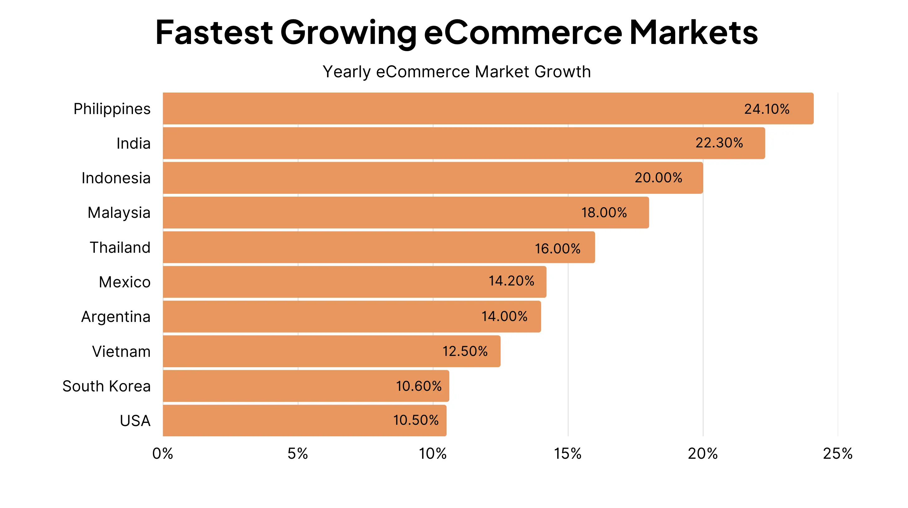

# 🎓Graduation Project: Cross-Platform Multimodal Search in E-commerce

## 📘Introduction

In recent years, Vietnam’s e-commerce market has witnessed remarkable growth, becoming a driving force in the digital economy. By 2024, e-commerce accounted for 9% of total retail sales and nearly two-thirds of the digital economy's value, placing Vietnam among the top 10 fastest-growing e-commerce nations globally.

The convenience of online shopping—enabling users to search, compare, and purchase products across platforms—has reshaped consumer behavior. However, with over 400 registered e-commerce platforms in Vietnam and major players like Shopee, Lazada, Tiki, TikTok Shop, and Sendo, product information is highly fragmented. This fragmentation complicates the product discovery process, requiring users to manually switch between apps and compare offerings.

Existing price comparison tools (e.g., websosanh.vn) rely mainly on keyword-based search, which struggles with inconsistent naming, spelling errors, and vague queries. In addition, modern websites use dynamic loading techniques (AJAX, infinite scroll), making traditional crawling methods ineffective. Many platforms also implement anti-scraping measures such as CAPTCHA or rate limits.

To address these challenges, this project proposes an end-to-end system that automates data crawling, storage, and search across platforms. Selenium is used to simulate real user behavior, allowing robust data extraction from dynamic pages. Crawled data is indexed using both **Elasticsearch** (for keyword-based search) and **Milvus** (for image and vector similarity search). The system leverages **OpenCLIP**, a multimodal deep learning model, to support image-based and hybrid searches.

## 🛠️ Technologies Used

This project integrates multiple technologies and frameworks to build a scalable, efficient, and intelligent multi-platform product search system:

### ⚙️ Backend & Data Collection

- **Python 3.10** – Core language for backend logic and crawling pipelines
- **Selenium** – Browser automation to crawl dynamic web content (supports AJAX, lazy-loading, infinite scroll)
- **Requests** – Used for lightweight data fetching and HTML parsing (for static parts)

### 🗃️ Data Storage & Search

- **Elasticsearch** – Full-text search engine for structured product metadata
- **Milvus v2.5** – Vector database for fast similarity search (image/text embeddings)
- **AWS S3** – Cloud storage for product images and data archives

### 📩 Message Queues & Communication

- **Amazon SQS** – Distributed message queue for decoupling crawlers and processors
- **RabbitMQ** – Internal task queuing for scheduling and parallel processing

### 🤖 AI & Embedding

- **OpenCLIP (ViT-L/14 336px)** – Pre-trained vision-language model for generating multimodal embeddings
- **PyTorch** – Deep learning framework to run OpenCLIP model
- **Faiss (optional)** – For local vector similarity benchmarking

### 🌐 APIs & Integration

- **FastAPI** – Web framework for exposing search and admin endpoints
- **Uvicorn** – ASGI server for running FastAPI
- **Docker** – Containerization for deploying crawlers and services

### 📈 Monitoring & Evaluation

- **Elasticsearch Dashboards** – For search log analysis and indexing performance
- **Custom Metrics Logging** – For measuring crawling rate, product coverage, etc.

## 📜 License

This work is licensed under a [Creative Commons Attribution-NonCommercial 4.0 International License](https://creativecommons.org/licenses/by-nc/4.0/).

## 👤 Author & Contact

**Duong Binh Minh**  
Final-year Computer Engineering Student – VNU University of Engineering and Technology  
📫 Academic Email: [21020778@vnu.edu.vn](mailto:21020778@vnu.edu.vn)  
📫 Personal Email: [minimum.195422@gmail.com](mailto:minimum.195422@gmail.com)  
🎓 Supervisor: ThS. Trần Mạnh Cường